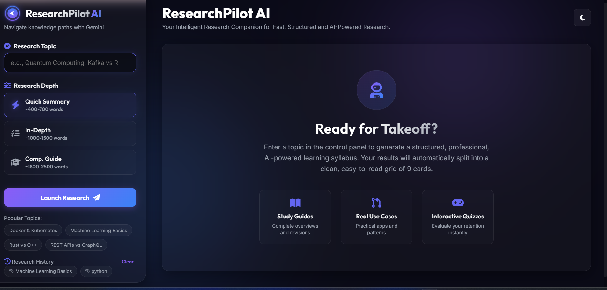
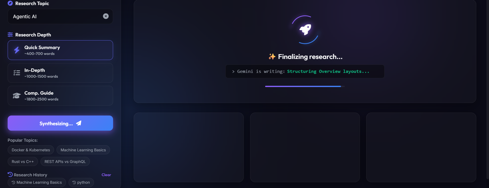
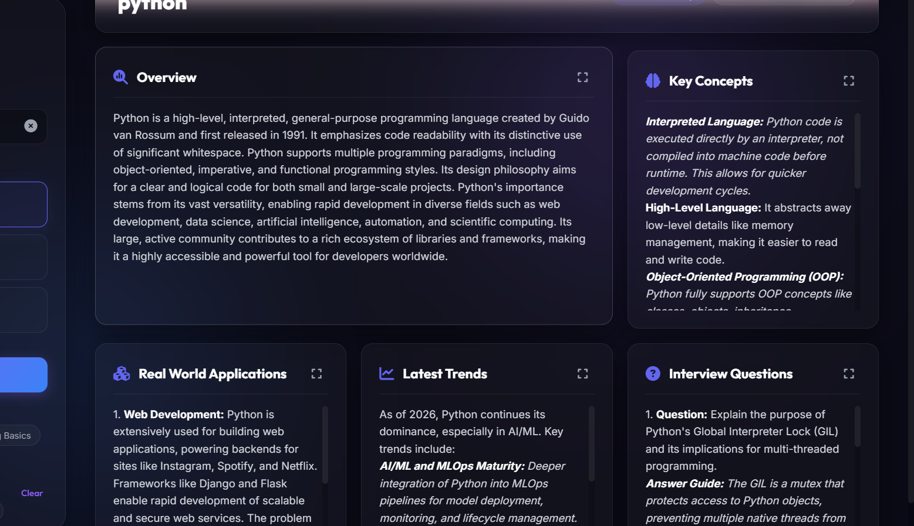

# ResearchPilot AI 🚀

ResearchPilot AI is an AI-powered research assistant built with **Python, Flask, and Google Gemini API**.

It helps users explore any topic by generating a structured research report with key concepts, real-world applications, interview questions, learning resources, quick revision notes, quizzes, and suggested next topics.

The project is designed to make learning and research more organized and easier to explore.

> **Project Status:** Currently available for local use. Deployment is planned for a future version.

---

## ✨ Features

- 🔍 AI-powered research on any topic
- ⚡ Multiple research depths:
  - Quick Summary
  - In-Depth Analysis
  - Comprehensive Guide
- 📚 Structured research reports
- 💡 Key concepts and real-world applications
- 💼 Topic-specific interview questions
- 📖 Learning resources
- 📝 Quick revision notes
- 🧠 Interactive quiz
- 🔗 Suggested next topics
- 📋 Copy generated report
- 📥 Download report in Markdown format
- 🌙 Responsive dark-themed user interface

---

## 🛠️ Tech Stack

### Backend
- Python
- Flask

### AI
- Google Gemini API
- Gemini 2.5 Flash

### Frontend
- HTML5
- CSS3
- JavaScript (ES6+)

### Libraries
- python-dotenv
- Google Generative AI

---

## 📸 Screenshots

### Home Page



### Research Configuration



### Generated Research Report



### Research Report – Additional View


---

## 🔄 How It Works

```text
User enters a topic
        ↓
Selects research depth
        ↓
Flask Backend
        ↓
Google Gemini API
        ↓
AI-generated research report
        ↓
User can read, copy or download the report